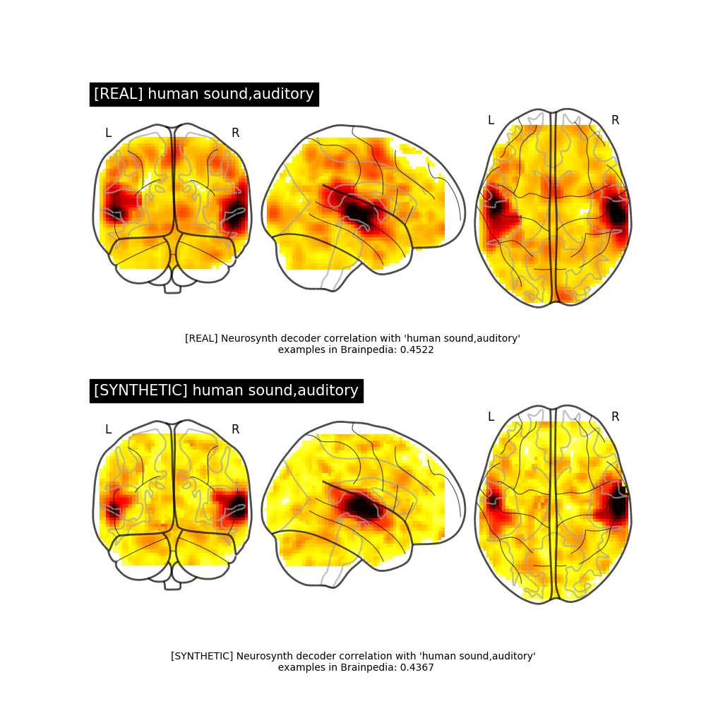

# ICW-fMRI-GAN
An improved conditional wasserstein generative adversarial network (ICW-GAN) that is trained to generate synthetic fMRI data samples.  The model is trained on NeuroVault collection 1952.

## Running the Code
```
# If on Ubuntu 16.04 and CUDA installation desired:
bash setup.sh

# Otherwise
pip3 install -r requirements.txt

# Run!
# python3 train.py <train_data_dir> <train_data_dir_cache> <output_dir>
python train.py data/collection_1952_train/ data/collection_1952_train_cache/ OUTPUT/train/

# python3 generate.py <path to generator> <train_data_dir> <train_data_dir_cache> <num samples to generate> <output directory>
python generate.py OUTPUT/train/models/generator data/collection_1952_train/ data/collection_1952_train_cache/ 1000 data/synthetic_testing/

# python evaluation/classifier_evaluation.py <train_data_dir> <train_data_dir_cache> <synthetic data dir> <synthetic data dir cache> <output directory>
python evaluation/classifier_evaluation.py data/collection_1952_train/ data/collection_1952_train_cache/ data/synthetic/ data/synthetic_cache/ OUTPUT/classifier_evaluation/
```

## Examples
### Training


### Samples

